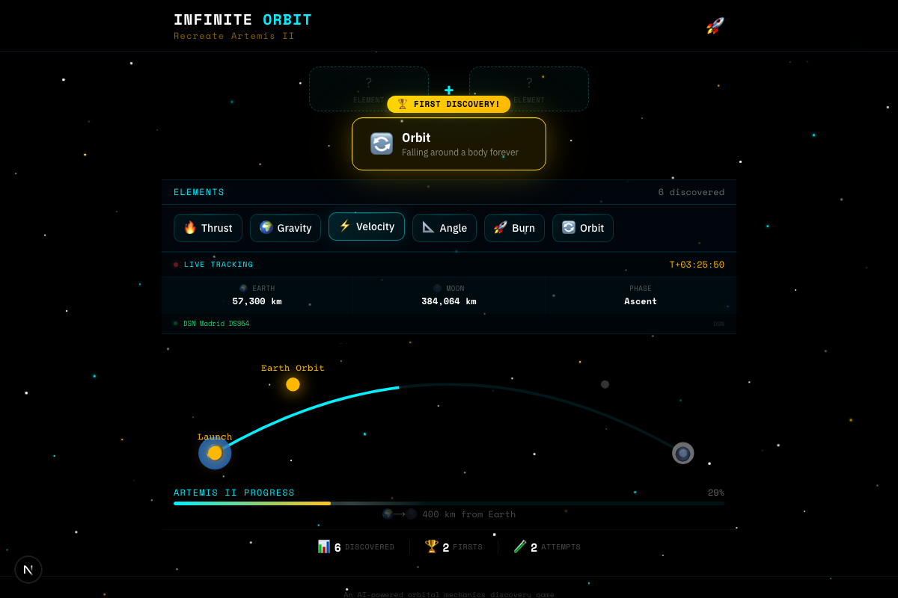

# Infinite Orbit

**Combine physics concepts. Discover orbital mechanics. Recreate NASA's Artemis II Moon mission.**

Start with 4 elements — Thrust, Gravity, Velocity, Angle. Tap two together. See what they create. Keep going until you've planned a trip to the Moon.

**[Play it now](https://zen-antelope-infinite-orbit.cluster-se1-us.nexlayer.ai)** — no sign-up, works on your phone.



---

## The Game

```
🔥 Thrust  + 📐 Angle     →  🚀 Burn
🚀 Burn    + 🔄 Orbit     →  🔁 Hohmann Transfer
🆙 Escape  + 📐 Angle     →  🛤️ Trans-Lunar Injection
🪃 Free Return + 🌒 Flyby →  🏆 Artemis II Trajectory
🏆 Artemis + 🔧 Delta-V   →  🌟 Mission Complete!
```

83 real orbital mechanics concepts — from basic burns to three-body problems. Every combination teaches you something real about how space travel works. You'll learn what a Hohmann Transfer is before you realize you're learning.

Easter eggs too. Try Gravity + Gravity. Or Burn + Burn. Or keep going until you find Spaghettification.

**Live NASA tracking** — the game pulls Orion's actual position from JPL Horizons and shows which Deep Space Network antenna is talking to the spacecraft right now. You're playing a puzzle while a real crew is flying the real mission.

---

## Deploy Your Own

Two steps. No local setup, no DevOps knowledge needed.

### 1. Give Claude Code the Nexlayer plugin

```bash
npx @nexlayer/mcp-install
```

### 2. Tell Claude to ship it

Open [Claude Code](https://claude.ai/code) and say:

> *"Deploy https://github.com/sasdeployer/infinite-orbit to Nexlayer"*

You'll get a live URL. That's it.

Claude reads the config, builds the container, deploys the game on a CPU and the AI model on a GPU, wires them together, and hands you the link.

### After it's live, keep talking:

| What you want | Say this |
|---|---|
| Check if it's working | *"Check the status of my deployment"* |
| Something broke | *"Show me the logs"* |
| Use your own domain | *"Set up infiniteorbit.app as my custom domain"* |
| Peek inside a container | *"Open a shell into the app pod"* |
| Restart it | *"Rolling restart the deployment"* |
| Take it down | *"Delete my infinite-orbit deployment"* |

---

## Make It Your Own

Fork it. Open it in Claude Code. Tell it what you want.

- *"Add combinations for solar sails and ion engines"*
- *"Change the theme to Mars colonization"*
- *"Add a multiplayer leaderboard"*
- *"Make it track the ISS instead of Artemis"*
- *"Deploy my fork to Nexlayer"*

Claude reads `CLAUDE.md` and knows the full architecture — every file, every design decision, every gotcha.

---

## How It Works Under the Hood

The interesting design choice: **there's no database and no embeddings.**

Most AI apps pipe everything through a RAG stack — embeddings, vector search, retrieval, then the LLM. This game doesn't need any of that because the input is constrained. Players can only combine two named elements. That means:

- **83 core combinations are hardcoded** in a hash map. Instant lookup, zero AI cost. This covers the entire Artemis II win path.
- **Novel combinations hit the LLM once**, and the result gets cached. The structured input (two nouns in, one noun out) makes LLM outputs consistent enough to cache as facts.
- **The LLM is never called twice for the same pair.** Every player who tries "Black Hole + Velocity" after the first one gets the cached answer instantly.

The game's universe grows from player curiosity. No training, no fine-tuning. Just a cache that fills up.

```
┌──────────────────────────────────────────────────────────┐
│  Nexlayer Cloud                                          │
│                                                          │
│  ┌────────────────────┐       ┌───────────────────────┐  │
│  │  Game (CPU)        │       │  AI Model (GPU)       │  │
│  │  ────────────────  │       │  ───────────────────  │  │
│  │  Next.js 16        │──────▶│  Llama 3.1 8B         │  │
│  │  83 hardcoded      │  only │  via Ollama           │  │
│  │  combos + cache    │  on   │                       │  │
│  │  NASA tracking     │  miss │  Called only for       │  │
│  │  Rate limiting     │       │  novel combinations   │  │
│  └────────────────────┘       └───────────────────────┘  │
│          │                                               │
│  ┌───────┴────────────────────────────────────────────┐  │
│  │  https://your-app.nexlayer.ai                      │  │
│  └────────────────────────────────────────────────────┘  │
└──────────────────────────────────────────────────────────┘
```

**Live data sources (no API keys needed):**

| Source | What it provides | Updates |
|--------|-----------------|---------|
| JPL Horizons | Orion's distance from Earth and Moon | Hourly |
| DSN Now | Which ground antenna is talking to Orion | Every 5 seconds |
| Simulated trajectory | Fallback based on published flight plan | Real-time |

<details>
<summary><strong>Full file structure</strong></summary>

```
infinite-orbit/
├── app/
│   ├── layout.tsx              # Root layout, fonts, OG metadata
│   ├── page.tsx                # Main page
│   ├── icon.svg                # Favicon
│   ├── globals.css             # All styles + animations
│   ├── api/combine/route.ts    # POST: combine two elements
│   ├── api/tracking/route.ts   # GET: live Artemis II tracking
│   └── og/route.tsx            # Dynamic OG image (1200x630)
├── components/                 # 11 React components
├── lib/
│   ├── combinations.ts         # 83 hardcoded element combinations
│   ├── cache.ts                # In-memory cache (10k cap)
│   ├── ollama.ts               # Ollama AI client
│   ├── tracking.ts             # NASA JPL Horizons + DSN
│   ├── game-state.ts           # Game state machine
│   └── constants.ts            # Starting elements, milestones
├── nexlayer.yaml               # Nexlayer deployment config
├── Dockerfile                  # Production container build
├── CLAUDE.md                   # Guide for Claude Code
└── .env.example                # Environment variables (all optional)
```

</details>

<details>
<summary><strong>Run locally instead</strong></summary>

```bash
git clone https://github.com/sasdeployer/infinite-orbit.git
cd infinite-orbit
npm install
npm run dev
```

Requires [Node.js](https://nodejs.org) 18+. For AI combinations, install [Ollama](https://ollama.ai) and run `ollama pull llama3.1:8b`.

</details>

---

## License

MIT — do whatever you want with it.

---

Built with [Claude Code](https://claude.ai/code). Deployed on [Nexlayer](https://nexlayer.com).
